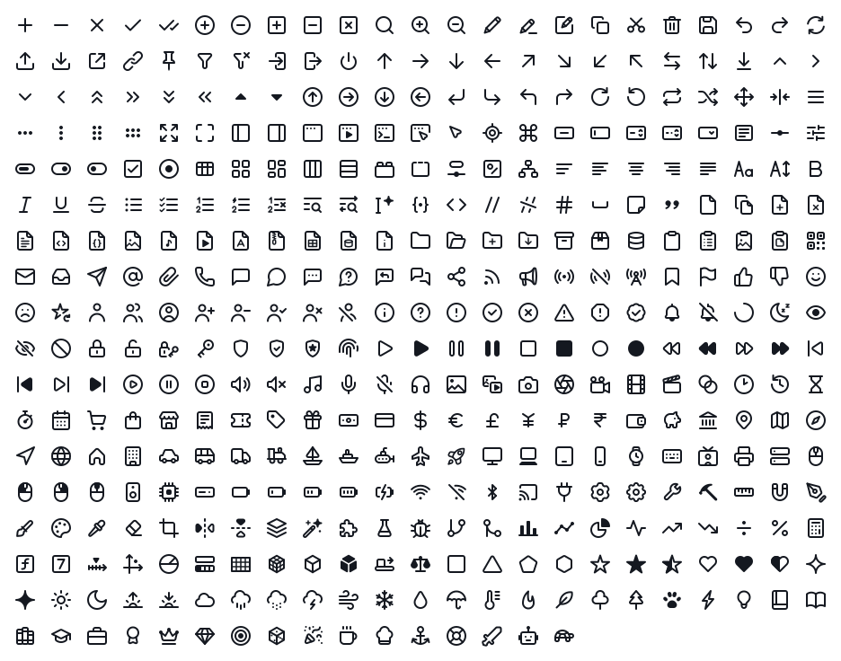
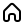

<p align="center">
  
</p>

<h1 align="center">Klaarheid Icons</h1>

<p align="center">
  Точные открытые иконки — <b>построены, а не обведены</b>.<br>
  <!--count-->407<!--/count--> иконок на сетке 24 с линией 2&nbsp;px — контуром заливкой и линией.
</p>

<p align="center">
  <a href="https://aumphaadr.github.io/Klaarheid-Icons/"><b>Смотреть и скачивать</b></a> ·
  <a href="#как-получить">Как получить</a> ·
  <a href="#как-построены-иконки">Как построены</a> ·
  <a href="README.md">In English</a>
</p>

<p align="center">
  <a href="LICENSE"></a>
  <a href="https://github.com/Aumphaadr/Klaarheid-Icons/actions/workflows/ci.yml"></a>
</p>

<picture>
  <source media="(prefers-color-scheme: dark)" srcset="assets/icons-dark.svg">
  
</picture>

## Почему «точные»

*Klaarheid* по-нидерландски — *ясность*. Каждая иконка здесь записана геометрией и вычислена, поэтому ничего
не сделано «примерно»:

- **Построены из примитивов.** Иконка описана в коде осевыми линиями из отрезков и дуг окружностей на сетке 24 × 24
  ([`src/icons.mjs`](src/icons.mjs)). Контур заливкой вычислен из них — смещением на ±1 с круглыми торцами и стыками
  и объединением деталей, — а не нарисован руками и не обведён с картинки.
- **Канонические кривые.** У окружности четыре узла на осях и рычаги 0,5523·r. Дуги режутся на осях. Торец линии —
  честный полукруг из трёх узлов. Горизонтали и вертикали лежат на целых координатах, поэтому в 24 px их края
  ложатся на пиксели.
- **Симметрия без обмана.** Иконки, задуманные симметричными, совпадают со своим зеркалом до шестого знака.
- **Проверка при каждой сборке.** [`tools/check.mjs`](tools/check.mjs) ищет кривые «прямые», надломы, лишние куски,
  неканонические окружности и неровные торцы; если есть Chrome, ещё и сверяет каждый контур с линией, которую
  браузер рисует по линейной версии.

## Как получить

- **Сайт** — [aumphaadr.github.io/Klaarheid-Icons](https://aumphaadr.github.io/Klaarheid-Icons/): поиск по-русски
  и по-английски, цвет, размер, узлы и рычаги, одна иконка в SVG или PNG или весь набор архивом ZIP (SVG либо PNG
  любого размера и цвета).
- **Репозиторий** — файлы лежат в [`svg/fill`](svg/fill) и [`svg/stroke`](svg/stroke); скопируйте нужные
  в свой проект.

### Две версии

| | `svg/fill` — контур | `svg/stroke` — линия |
|---|---|---|
| Что внутри | один залитый `<path>`: точный контур | осевые линии: `stroke-width="2"`, круглые торцы и стыки |
| Цвет | `fill="currentColor"` | `stroke="currentColor"` |
| Когда брать | нужна точная форма: спрайты, иконочные шрифты, редакторы | удобно править линию стилями, как у Lucide или Feather |

Обе версии рисуют одну и ту же картинку: контур вычислен из линии.

## Как подключить

```html
<!-- в строке: иконка берёт цвет окружающего текста -->
<svg width="24" height="24" viewBox="0 0 24 24" aria-hidden="true">
  <path fill="currentColor" d="…"/>
</svg>

<!-- картинкой -->

```

```css
/* маской: цвет задаёт background-color */
.icon-house {
  width: 24px;
  height: 24px;
  background-color: currentColor;
  mask: url(svg/fill/house.svg) center / contain no-repeat;
}
```

## Как построены иконки

| Правило | Значение |
|---|---|
| Сетка | 24 × 24, рисунок держит поле 1 |
| Линия | 2, торцы и стыки круглые; тонкая 1,5 — только для мелких знаков в тесном поле |
| Просвет | 2 между отдельными деталями (1,5 вокруг тонких знаков); сходящиеся детали кончаются на осевой соседки |
| Окружности | 4 узла на осях, рычаги 0,5523·r |
| Дуги | режутся на осях; торец — две равные четверти; стыки и скругления — равные куски до 90° |
| Координаты | горизонтали и вертикали — на целых |

Как это собирается:

```
src/icons.mjs ──tools/build.mjs──▶ svg/stroke, svg/fill ──tools/check.mjs──▶ отчёт
   (детали)      (src/geom.mjs)                          ──tools/site.mjs──▶ docs/ (сайт), assets/
```

## Разработка

Нужен Node.js 20 или новее; зависимостей нет.

```sh
npm run build          # svg/fill и svg/stroke из src/icons.mjs
npm run check          # проверка геометрии, около полутора минут
npm run check:pixels   # то же и попиксельная сверка в headless Chrome
npm run site           # docs/ (GitHub Pages) и картинки в assets/
npm run serve          # посмотреть docs/ на http://localhost:8080
```

| Путь | Что там |
|---|---|
| `src/icons.mjs` | описание иконок — единственный источник |
| `src/geom.mjs` | геометрическое ядро: смещение отрезков и дуг, стыки, объединение, вырезы, канонические кубики |
| `src/meta.mjs` | каталог для сайта: категории, русские названия, слова для поиска |
| `src/third-party.mjs` | иконки, совпадающие с иконками Lucide и Tabler (см. [THIRD-PARTY-NOTICES.md](THIRD-PARTY-NOTICES.md)) |
| `svg/` | собранные иконки (генерируются) |
| `tools/` | сборка, проверка, сайт и просмотр |
| `site/` | страница сайта: `index.html`, `app.css`, `app.js`, шрифты |
| `docs/` | опубликованный сайт (генерируется) |

Как добавить или поправить иконку — в [CONTRIBUTING.md](CONTRIBUTING.md) (по-английски).

## Пожелания

Не хватает иконки? [Заведите issue](https://github.com/Aumphaadr/Klaarheid-Icons/issues/new?template=icon-request.md):
что она должна значить и где будет стоять.

## Благодарности

Первые иконки нарисованы для проектов автора — [Idyllium](https://github.com/Aumphaadr/Idyllium),
[SignoreBot](https://github.com/Aumphaadr/SignoreBot) и ООМ. Композиции многих иконок общего назначения следуют
общепринятым рисункам [Lucide](https://lucide.dev) и [Feather](https://feathericons.com). Каждая иконка построена
в коде из примитивов, но на той же сетке и той же линией, что у Lucide и [Tabler Icons](https://tabler.io/icons),
поэтому часть иконок вышла такой же, как в этих наборах: с Lucide совпали <!--lucide-count-->101<!--/lucide-count-->,
с Tabler — <!--tabler-count-->24<!--/tabler-count-->; в основном это простые знаки вроде плюса, шевронов и стрелок. Они
перечислены в [THIRD-PARTY-NOTICES.md](THIRD-PARTY-NOTICES.md), на них действует и лицензия Lucide (ISC) или Tabler (MIT).

Сайт набран шрифтами [Onest](https://github.com/simpals/onest) и
[Source Code Pro](https://github.com/adobe-fonts/source-code-pro) — оба под SIL Open Font License 1.1;
файлы шрифтов и их лицензии лежат в [`site/fonts`](site/fonts).

Геометрическое ядро и описания иконок написаны с Claude — ИИ-ассистентом Anthropic — под руководством автора;
каждую иконку автор просмотрел сам.

## Лицензия

[MIT No Attribution (MIT-0)](LICENSE) © 2026 Nathaniel Larsson — лицензия MIT без её единственного условия.
Коротко:

- бесплатно — в личных и коммерческих проектах, открытых и закрытых;
- без разрешений и без упоминания автора — ни в интерфейсе, ни на сайте, ни в титрах;
- совсем без условий: даже текст лицензии прикладывать к файлам не нужно;
- иконки можно менять: перекрашивать, перерисовывать, включать в свои наборы и шрифты.

Сноска: иконок, совпадающих с иконками Lucide, — <!--lucide-count-->101<!--/lucide-count-->, с иконками Tabler —
<!--tabler-count-->24<!--/tabler-count-->; на них действует и лицензия Lucide (ISC) или Tabler (MIT) — используете их,
сохраняйте текст нужной лицензии. Списки и тексты — в [THIRD-PARTY-NOTICES.md](THIRD-PARTY-NOTICES.md), на сайте такие
иконки помечены в карточке.

Неофициальный перевод лицензии на русский — [LICENSE_RU.md](LICENSE_RU.md).
